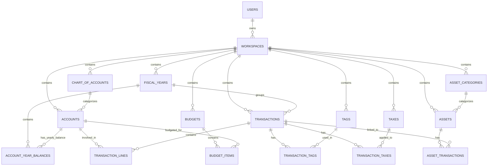
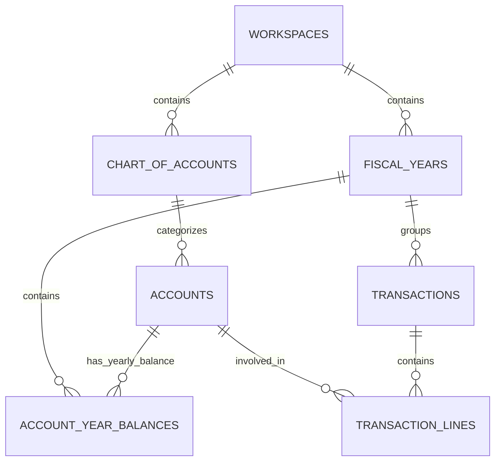
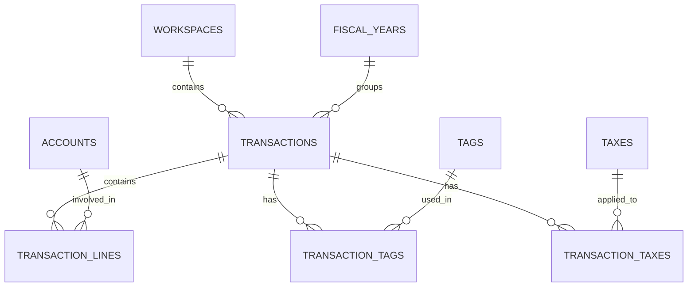
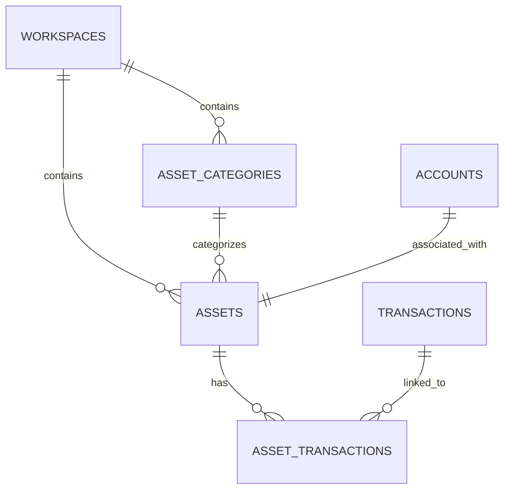
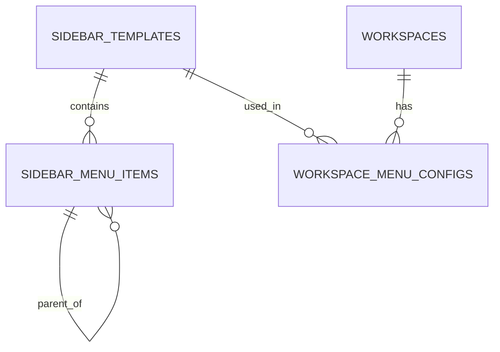

# AutoBooks 数据库关系图

本文档展示了AutoBooks系统中主要数据库表之间的关系。这些关系图有助于理解数据库结构和表之间的依赖关系。

## 核心表关系

## 会计核心关系

## 交易相关关系

## 资产管理关系

## 侧边栏菜单关系

## 表格属性说明

### 用户和工作空间
- **USERS**: 用户信息表，包含用户的基本信息
- **WORKSPACES**: 工作空间表，支持个人和商业类型，是数据隔离的基本单位

### 会计核心
- **CHART_OF_ACCOUNTS**: 会计科目表，定义账户的类型和分类
- **ACCOUNTS**: 账户表，实际财务记录的载体
- **FISCAL_YEARS**: 会计年度表，定义财务周期
- **ACCOUNT_YEAR_BALANCES**: 账户年度余额表，存储每个账户在每个会计年度的期初/期末余额

### 交易相关
- **TRANSACTIONS**: 交易主表，记录交易的基本信息
- **TRANSACTION_LINES**: 交易行表，实现双重记账
- **TRANSACTION_TAGS**: 交易标签关联表
- **TRANSACTION_TAXES**: 交易税种关联表

### 资产管理
- **ASSETS**: 资产表，记录公司拥有的资产
- **ASSET_CATEGORIES**: 资产类别表
- **ASSET_TRANSACTIONS**: 资产交易关联表

### 其他功能表
- **TAGS**: 标签表，用于分类交易
- **TAXES**: 税种表，定义税率和税种
- **BUDGETS**: 预算表
- **BUDGET_ITEMS**: 预算项目表

### 侧边栏菜单
- **SIDEBAR_TEMPLATES**: 侧边栏模板表
- **SIDEBAR_MENU_ITEMS**: 侧边栏菜单项表
- **WORKSPACE_MENU_CONFIGS**: 工作空间菜单配置表

## 注意事项

1. 图表使用Mermaid语法，可以在支持Mermaid的Markdown查看器中查看
2. 关系使用以下符号表示：
   - `||--o{`: 一对多关系
   - `||--||`: 一对一关系
   - `}o--o{`: 多对多关系
3. 为了简化图表，省略了一些次要字段和关系
4. 实际数据库中的外键约束和级联规则可能与图表中的箭头方向有所不同
